= CBSA - ASFC: Enterprise Strategic Roadmap
:doctype: book
:icons: font
:title-page:
:toc:
:toclevels: 5
:Author:    Hany Greiss <Hany.Greiss@cbsa-asfc.gc.ca>
:authorinitials: hg
:Email:     Hany.Greiss@cbsa-asfc.gc.ca
:revdate:   11/11/2021
:revnumber: 1.0
:revremark: DRAFT
:source-highlighter: rouge
:url-ex: https://cbsa-asfc.gc.ca
:data-uri:
:orgname: CBSA - ASFC
:blank: {empty} +

<<<

== Figures and Tables
element_list::[element=image]

element_list::[element=table]

<<<

== Executive Summary

The following Enterprise Strategic Roadmap, *ESR*, is a strategic blueprint meant to convey and communicate:

* a guide for implementing a _digital transformation_ of the Call Centres, with the goals to;
** improve the *_Customer Experience_*
** align the various Call Centre Lines of Business (*LOB*)
** enhance the reporting across the Enterprise
* a change management plan to move the Agency towards;
** new tools, products and technologies, such as: 
*** *Microsoft(R) Dynamics 365*(TM) and *Amazon Connect*(TM)

<<<

== Purpose

The *ESR* is an _essential_ planning tool for the Agency's Executive Management and Call Centre Program Managers 
from the different Lines of Business to _visualize_ the broader needs and _goals_.

The *ESR* assists with this _visual roadmap_, as opposed to a strictly tactical outline of required activities, in several ways:

* Stakeholders Buy-In
** Clearly show the _Big Picture_.
** Conveys how this transformation improves the _Customer Experience_.
** Depicts how productivity will improve.
** Presents how this can be achieved and _lower_ operational costs.
* Sharing Details
** Provides multiple views from different perspectives for a variety of audiences.
*** High-Level views for the strategic thinkers.
*** Detailed-Level views for the tactical implementers.
** Provides timelines of the transformation.
** Outlines the estimated resources requirements and anticipated budgets.
** Clarifies the _interdependencies_ with other systems.
* Prioritize Activities
** Assists with planning and adapting to unexpected changes.
** The *ESR* provides the strategic reference point that remains constant.
** The main objectives remain clear.

<<<

== Roadmap Outline

The roadmap comprises 5 key stages critical to the transformation process. A solid understanding of the present status, i.e. the _current state_, of the Agency's Call Centres operations is fundamental to the process. The current state is purposely viewed from a high-level and technological details are _not_ discussed except where some context may be valuable. 

The 5 stages of the roadmap process are: 

[cols="60%a,40%a",frame="none",grid="none"]
|===
||

|* <<current>>
** where are we _today_?
* <<desired>>
** where do we want to be in the _future_?
* <<gap>>
** What are the items preventing the transformation?
* <<items>>
** What is needed to complete the transformation?
* <<prioritize>>
** Identify, i.e. optimize, the best sequence to follow?
|image::resources/images/roadmap-future.png[]

|===

<<<

Knowledge of the current and desired states is fundamental in extracting the gaps that exist for the transformation to succeed. The prioritization and optimization stages provide the actual steps, sequences to follow and recommendations for the transformation. 

[IMPORTANT]
.Assumptions
====
*Microsoft(R) Dynamics 365*(TM) , _hosted and managed by GCCase_, and *Amazon Connect*(TM), constitute the technology infrastructure core, being _already_ selected by the Agency. Based on this assumption, the *ESR* forgoes the typical _options analysis_ on the technology selections typically associated with the recommendations. 
====

{blank}
[#img-l1]

{blank}

[NOTE]
====
*Microsoft(R) Dynamics 365*(TM) is a complex product with multiple variants. At a very high-level, there are two variants, a _cloud_ version hosted on *Azure*(TM) and an _on-premises_ version that clients can install on provided infrastructure. 

The versions and features of the cloud and on-premises versions differ. The cloud version offers the most up-to-date features. GCCase is a _private cloud_ offering of the on-premises version of *Microsoft(R) Dynamics 365*(TM). Thus, the term _cloud_ can be easily misunderstood. 

In addition, *Microsoft(R) Dynamics 365*(TM) offers various add-on modules, which are basically tailored application verticals for various market segments, such as a sales module to track leads, manage sales pipelines, opportunities and a customer service module, to track cases, incidents, service tickets and the customer support process, as well as several other market segments. 

The _customer service_ module on the *GCCase* hosted on-premises version of *Microsoft(R) Dynamics 365*(TM) is what will be assumed in the roadmap discussion.

Additional information can be found at https://docs.microsoft.com/en-us/dynamics365/customer-service/overview[*Microsoft(R) Dynamics 365*(TM)]
====

{blank}
[#img-l2]

{blank}

[NOTE]
====
*Amazon Connect*(TM) is a cloud contact center. Once configured, agents located within the Agency can start interacting with customers. *Amazon Connect*(TM) can also integrate with enterprise applications such as, *Microsoft(R) Dynamics 365*(TM), hosted by GCCase. This allows for auto-creation of activities associated with a case which is discussed later in this document.

Additional information can be found at https://aws.amazon.com/connect/[Amazon Connect(TM)]
====

<<<

[[current]]
=== Current State

The CBSA's _Information, Science & Technology_ Branch operates a number of different *Call Centres* using a variety of tools with similar, but different, processes across the *_Lines of Business_* (*LOB*). In some cases, the tools and applications used are older, not tailored or necessarily suited to, Call Centre operations, e.g. *JIRA*. The intake processes across the *LOB* are also different. Email requests are manually processed and tracked. Service tickets created via follow-up phone calls may or may not be associated to the manually created service request via the email intake process.

{blank}
[#img-l3]

{blank}

[NOTE]
.Agency Call Centre Review
====
A comprehensive analysis of the Agency's Call Centres was conducted and documented, which summarizes the Call Centre operations within the CBSA. The report's key focus is on the organizational and operational structure, resource allocation and financial aspects and not specific to the technology infrastructure.
====

{blank}
[#img-l4]

{blank}

The *LOB* each operate as classic silos, totally isolated from one another. This _compartmentalization_ offers advantages: 

* application failures are limited to a single *LOB*
* customizations of the business processes, the look and feel and general operations may be completely tailored to the *LOB*.

{blank}
{blank}

[#img-silo]
.Silo Architecture
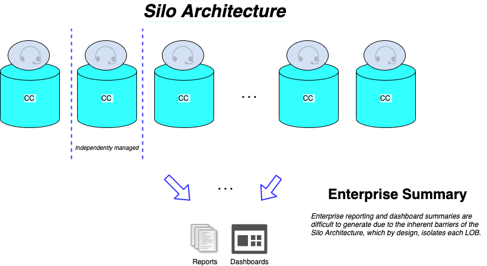

<<<

==== Advantages, or Limiting?

These _advantages_ however, are limiting and _inefficient_ when viewed from an Enterprise perspective. The advantages listed above result in: 

* limiting, or seriously restricting, the ability to report on the Enterprise as a whole
* isolating the applications' data makes it prone to duplication and replication across *LOB*
* differing and customized business processes across *LOB* may seem advantageous, but they in fact: 
** increases training requirements
** increase the overall number of operations performed across *LOB*, e.g. each *LOB* may have different ways to create an account or contact.
* standard maintenance procedures such as backups, regular maintenance, security updates, etc. must be performed for _each_ *LOB*.

==== Service Level Agreements (SLA)

Service Level Agreements (SLAs) at the CBSA Call Centres currently are not tracked and determining the adherence to the stated SLAs is difficult to quantify. For similar reasons as described above, tracking SLAs for the individual *LOB* and at the Enterprise level is challenging.

==== Knowledge Management

Knowledge Management is inconsistent across the *LOB* and call centre operators can not reliably locate and identify the required resources for common requests. 

<<<

[[desired]]
=== Desired State

Similar to planning a trip, where knowledge of the destination is critical, the _Desired State_ is a place where we can: 

* Enforce collaboration between the *LOB* and while enforcing the Agency's Security Policies using <<bu>>;
* Manage <<contacts>> and <<accounts>>;
** The contacts and accounts that are associated with cases are _customizable_ , meaning the attributes associated to them may be modified.
** Duplicate detection rules prevent the duplication of the same contact or accounts and improves the quality of the data.
* Track customer issues using <<cases>>;
** <<cases>> or _incidents_, _tickets_, _service tickets_, all refer to the *customer issue* being tracked.
** Create and schedule services;
* Record customer interactions related to a case using <<activities>>;
** Emails, Phone calls, Tasks, ...,  _the activities_;
** Self-service options for the client via a portal, chatbot
* Share information using <<knowledge>>;
* <<queues>>
** Create and manage queues to route cases to the right channels;
* <<sla>>
** Create and track service levels through *Service-Level Agreements* (*SLA*);
* <<entitlements>>
** Define and manage service terms using support structures;

<<<

* <<reports>>
** Manage performance and productivity through reports and _real-time_ dashboards;
** At both the Business Unit and Enterprise levels;
* <<portals>>
** Self-services, 
*** Access to FAQs, Documents, Forms and other useful resources;
*** Eliminates the simplest and most common requests.
** _Chatbots_ image:resources/images/chatbot.png[Chatbot,25,25,align='center'] and Artificial Intelligence (*AI*)
*** Assists the customer with locating and identifying resources to common issues or requests without the need to interact with the call centre;
*** Reduces the call volume;
*** Improves the customer experience. 

[#img-path]
.Client Experience
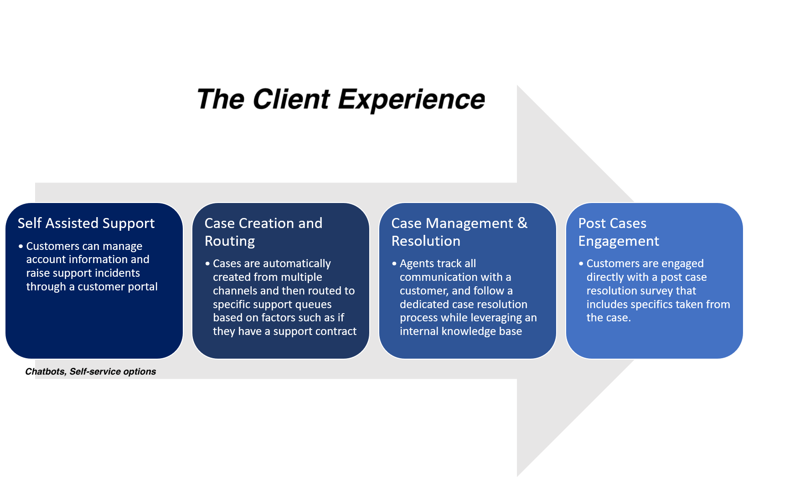

See <<all>> and <
>

<<<

=== _Destination_ Details

The _Desired State_ must fully describe and clearly state the goals and objectives. This stage of the roadmap provides more in-depth details of key aspects of the desired state. Continuing with the travel analogy, planning the trip details leaves fewer surprises. 

In addition, a better understanding of the desired state simplifies the later stages of the roadmap. Armed with a solid comprehension of both the current and desired states, the gap analysis is more accurate and complete.

[#img-milestone]
.Roadmap Planning
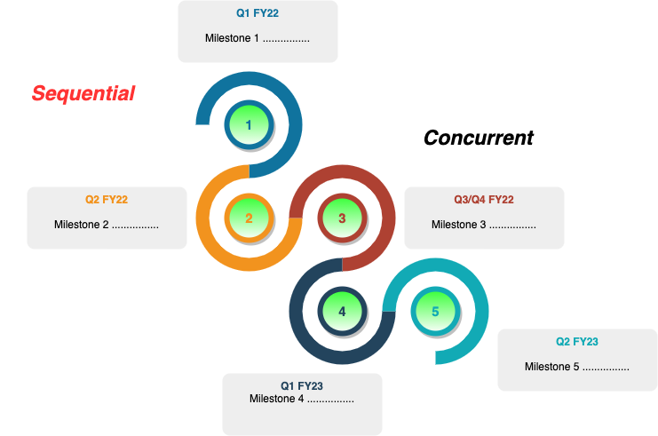

<<<

[[contacts]]
=== Contacts

Contacts represents the _customer_ associated with the <<cases>>. Contacts are created, looked up and possibly updated when retrieving or creating a case. The attributes associated with a contact are _modifiable_ since different *LOB* may want to track different attributes. Data detection rules provide prevent unnecessary duplication of contacts across business units.

Contacts may be configured by default as _shareable_ across the *LOB*. They may also be marked as private and only accessible from the *LOB* or the parent business unit.

[#img-contact]
.Contacts
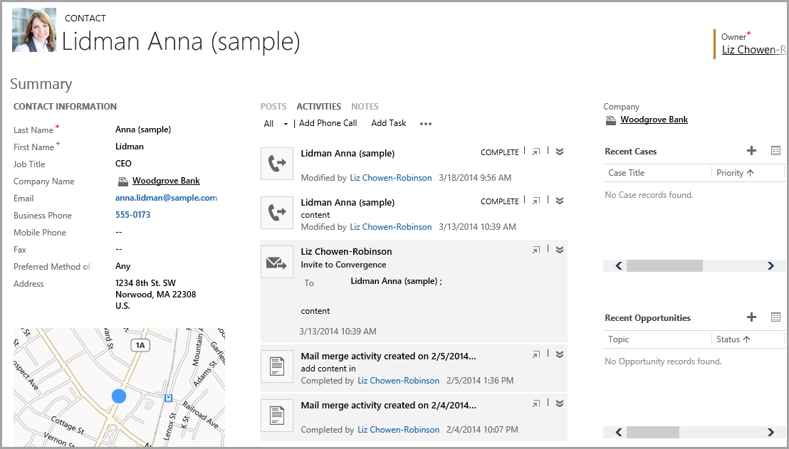

[[accounts]]
=== Accounts

[cols="70%,30%a",frame="none",grid="none"]
|===
||

|
Accounts represent the organizations that the Agency deals with and are typically associated with one or more contacts, especially larger organizations. Accounts, just like contacts, may have custom attributes and are shareable between the *LOB* or private to a *LOB*. Data duplication rules may also be added to prevent duplication of account records.
|
[#img-account_contact]
.Account => Contact
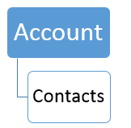

|===

[cols="25%a,10%,65%a",frame="none",grid="none"]
|===
|||

|
[#img-account]
.Account
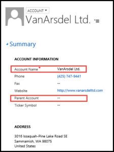
|
|
[#img-accountdetails]
.Account Details
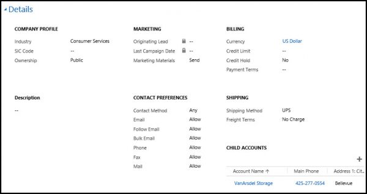

|===

<<<

[[cases]]
=== Cases

Cases typically represents a situation or incident that's reported by a customer and that requires a resolution. Cases are designed to track the process from the initial intake of an incident, through the remediation process, to the final resolution. From a customer service standpoint, a case can represent several items. For instance: 

* Inquiries 
** The customer might have a specific questions about a form, rules and regulations or a service. 
* Requests 
** The customer might have a specific request, like a request for more information, a procedure or some type of action.
* Issues
** The customer might be having a problem and requires assistance.

An end-to-end case management solution can not only helps identify cases but also assist routing each case to the most appropriate agent who can then provide guidance and resolve the case. An orchestration between a number of components help achieve this, including:

* Cases: 
** A case represents a single incident of service. The case may represents anything, in the _context of a customer interaction_, that requires some type of resolution or answer.
** _Multiple_ cases can be associated with a single customer at any time.
* Activities: 
** Activities typically represent the interaction with a customer, e.g. a phone call or an email. 
** _Multiple_ activities can be associated with a single case.
* Support Structures: 
** Support Structures define the support services that a customer is entitled to, similar to _support contracts_.
* Knowledge articles: 
** The knowledge base is a repository of informational articles that help customer service representatives resolve cases.
* Queues: 
** A queue is a place to organize and store activities and cases that are waiting to be processed.
* Service-Level Agreements (*SLA*): 
** *SLA* are a way to track and define what should happen when a case is opened, like how long it should take to respond to a customer.

<<<

==== Case Creation

Cases can be created in multiple ways: 

[cols="45%a,5%,50%a",frame="none",grid="none"]
|===
|||

|

* Manually by an agent;
** Incoming phone call, converting an _activity_.
* Automatically: 
** Self-service Portal
** Incoming email

|

|

[#img-case-activities]
.Activities Associated to a Case
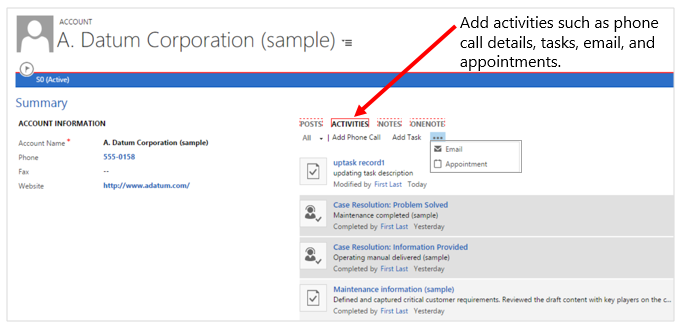
|===

==== Business Process Flows

Business Process Flows, (*BPF*), are used to define a set of steps for customer service agents to follow to take them through a desired outcome. The business process steps provide a visual indicator that tells agents where they are in the business process. Business process flows reduce the need for training because new agents don’t have to focus on which entity they should be using. They can let the process guide them. Business processes can be configured with flows that to allow agents to get _up-to-speed_ more quickly and avoid mistakes and improve the customer experience.

[#img-bp]
.Business Process Flows
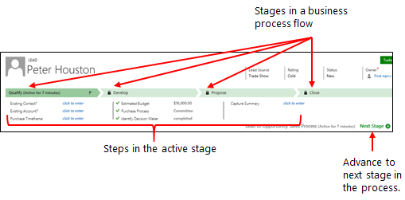

The _red arrows_ point to the _stages_ of the Business Process Flow. Each stage presents a view of precisely what must be completed at this point of the *LOB* process. For example, when a service ticket is being closed, a mandatory field _must_ be filled indicating the service tickets final status. This field would _not_ be visible in the previous stages since it does not comply with the *LOB* procedures. At any point of the process only one stage is active and is _highlighted_. This makes it simpler for customer service agents to follow and comply with the *LOB* procedures and reduces training requirements, minimizes errors and increases efficiency.

<<<
[[activities]]
=== Activities

Cases might be the result of an activity like an email, phone call, or task. The support agent might receive an phone call requesting service directly from a customer. The phone call, i.e. _activity_, can be converted directly to a case. The case gets created and the phone call activity is recorded and associated to the case. As the case goes through the process, all the interactions are captured and recorded the same way. The chronology, timeline and history of the interactions are recorded and associated as a collection of _activities_. Follow-up and scheduled tasks are recorded the same way against the case. 

The activities provide a complete picture of the support provided on the case.

{blank}
[#img-l5]

{blank}

[#img-activities]
.Activities
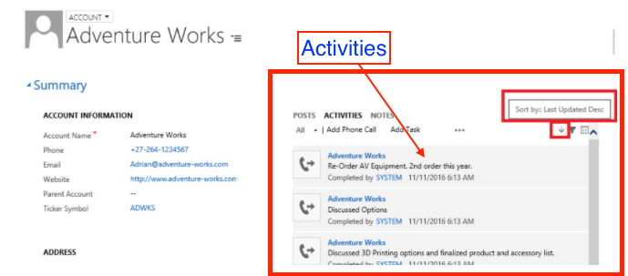

{blank}
[#img-l6]

{blank}

Activities can also be associated with contacts and accounts as well as other entities. Notes can also be created and associated to an activity, including attachments.

[IMPORTANT]
====
Attachments should be stored within the Agency's Apollo Document Management facility rather than attached to an activity whenever possible. There are several reasons why this is better, primarily because the file attachment is more easily shared.
====

[#img-activity-model]
.Activity Model
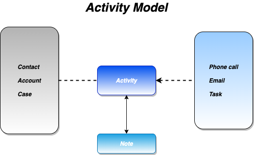

<<<
[[knowledge]]
=== Knowledge Management

Knowledge articles can address any number of issues customers encounter interacting with the agency's services. Types of Knowledge articles can include solutions to common issues, forms, documentation, answers to frequently asked questions (FAQs), and more. Knowledge articles comprise a variety of content, such as documents, videos, images, and other resources that can be used to assist with the customer's inquiry or issue.

The content can be created at any time, even while working on a case, to capture the experiences used in assisting the customer which can save time with similar cases that may arise.

[#img-km]
.Knowledge Management
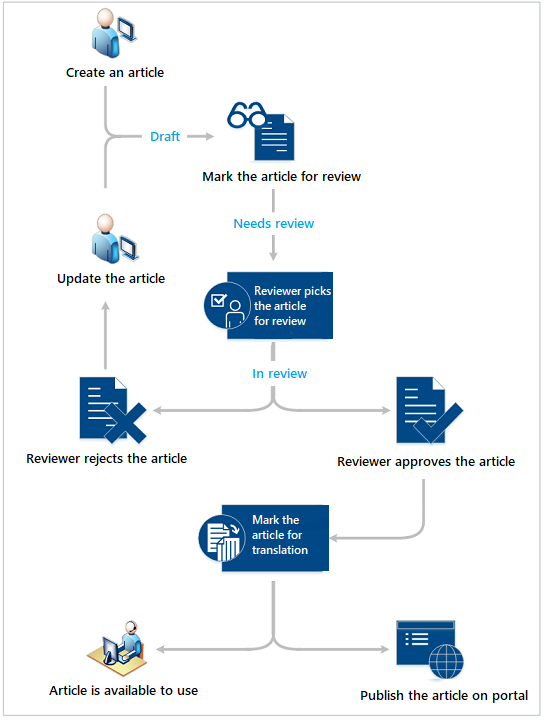

<<<
[[queues]]
=== Queues

Queues and rules are used to manage the routing of cases that come in. Customer can be routed to the appropriate queue based on the level of service, type of inquiry, type of request and various other criteria.

[#img-queues]
.Queues
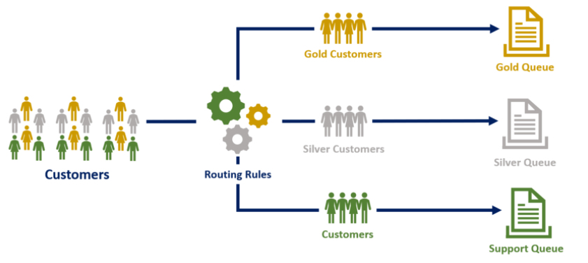

[[sla]]
=== Service-Level Agreements

Service-level agreements (*SLA*) enable businesses to track support policies and ensure customers are being supported per the support policy to which they are entitled. Businesses use SLAs to govern support customer support structures. *SLA* include policy details such as how quickly a customer is entitled to receive support, how many support requests a customer can make, and how long a customer can be supported as part of the agreement.

Metrics or key performance indicators (*KPI*) can associated with to the *SLA* to attain the expected service level. *KPI* can be used to issue warnings about any issues the customer support team might be having.

[#img-sla]
.Service Level Agreements
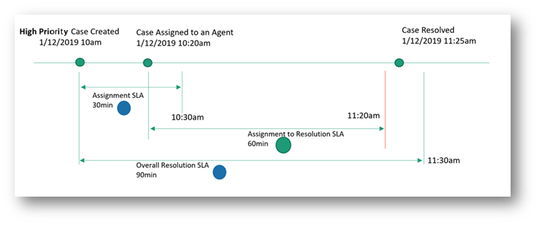

<<<
[[entitlements]]
=== Support Structures

Support Structures are used to provide different levels of support for the Agency's customers. Support Structures define the support terms, which may be based on number of hours or number of cases. The customer’s support level can vary based on the service agreements between the Agency's *LOB* and the customer. Customers may be entitled to different support levels. This information helps the Agency's customer support agents verify eligibility for and create cases for them accordingly.

[#img-entitlements]
.Support Structures
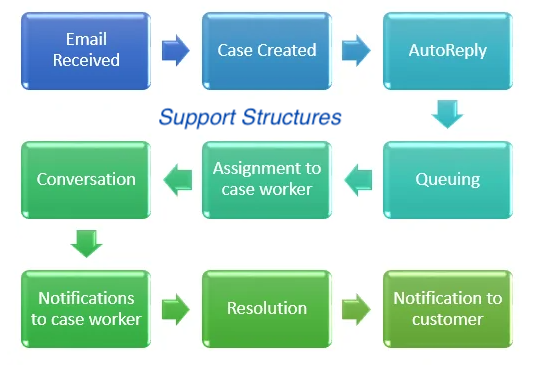

<<<

[[reports]]
=== Reports and Dashboards

Reports and dashboards provide a clear picture and help improve system performance of the customer service system. 

==== Key Features: 

* Live 
** Reports can be produced as scheduled or ad-hos and dashboards can display live information.
* Business Unit or Enterprise Level
** Reports and Dashboards can be specific and customized for a Business Unit or available for Enterprise views.
* Key performance indicator charts provide the basics of how the system is performing.
* Graphical charts provide trends and breakdowns of cases from a variety of views.

[#img-dashboard]
.Dashboards
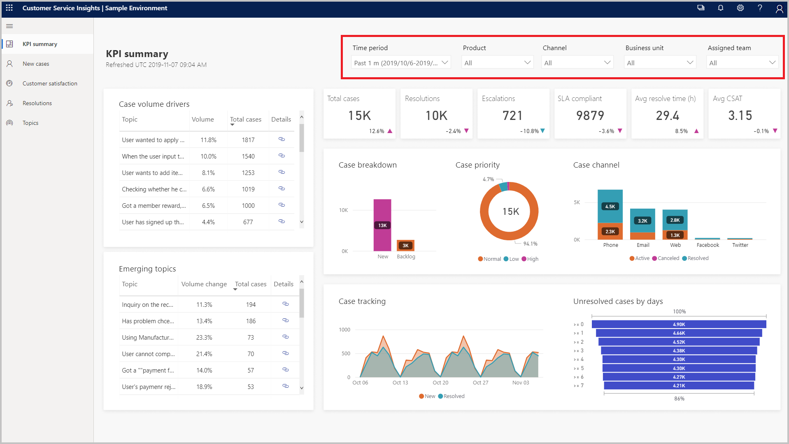

<<< 

=== Isolation, Yet Cooperation

The desired state should allow the *LOB* the ability to: 

* operate independently;
* manage the business process for the *LOB*;
* selectively share, _as-required_ common data elements, e.g. contacts, accounts;
* control access to the *LOB*;

In other words, the *LOB* can operate as independent applications that are part of a common collective. The desired state requirements listed above, without being specific, provide the a superset of the required features. 

[#img-bu]
.Business Units
image::resources/images/bu.png[Business Units,450,450,align='center']

=== Advantages

The desired state architecture provides a number of advantage: 

[cols="50%a,50%a",frame="none",grid="none"]
|===
||

|

* Improved _Customer Experience_.
* Remove barriers to access of data.
** One common data layer is effectively and efficiently shared.
* Eliminate data redundancy.
* Improved understanding of the data.

|

* Improved harmonization and analytics.
* Increased compatibility and collaboration across LOBs, _where appropriate_.
* Improved and more consistent business processes.
* Higher accuracy of data.

|===

<<<

[[bu]]
=== Business Units 

The _Business Units_ represent the individual Call Centres. Each Business Unit may operate independently when viewed from within and yet is part of a collection of Business Units that are all part of the Enterprise Call Centre collective. Using security roles assigned to individual users and teams as well as assigned memberships to one or more of the Business Units cooperation and isolation can be managed and controller. Enterprise-wide and Business Unit level reporting and dashboard summaries are available in real-time.

{blank}
{blank}

[#img-bumodel]
.Business Unit Security Model
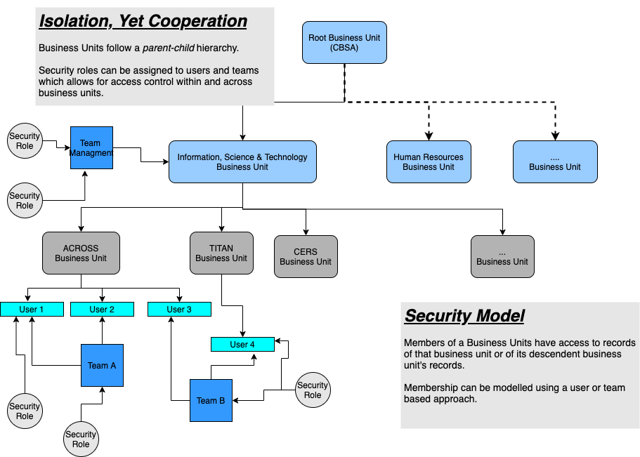

{blank}

[#img-roles]
.Role Based Security Model
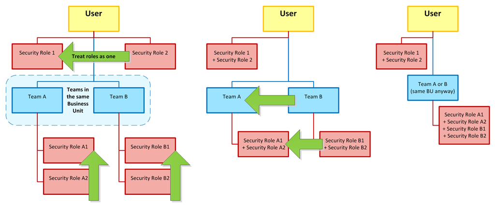

<<<

Each individual Business Unit can manage: 

[[teams]]
* Access for users and teams image:resources/images/teams.png[Teams,25,25,align='center']
** _teams_ are a group of users
** [[sr]]security roles can be assigned to a user or a team, which effectively assigns the security role to all members of that team
** security roles represent a group of privileges.
* The intake process
** email, phone calls, etc.
* Case creation process
* SLA Tracking, KPI alerts
* Entitlement Management
* Case lifecycle, i.e. Business Process

[#img-desired-state]
.Desired State
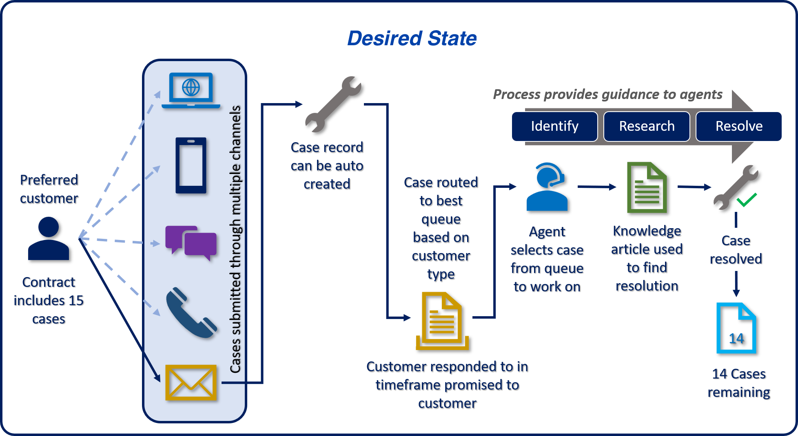

<<<

[[portals]]
=== Additional Features of the Desired State

Additional features of the desired state are:  

* Document Management Integration Ready
** Integrates with the Agency's existing Apollo Document Management facilities.
* Data Duplication Rules
** Checks for duplicate records when creating new contacts, accounts and other record types where duplication is to be avoided.
* Portal-ready
** Integrates with an internal or public-facing portal to provide higher-level services, such as, self-help, interactions with chatbot, artificial intelligence systems, etc.
* Services Ready
** REST API for custom integration activities

[NOTE]
.REST API
====
A REST API, or _RESTful_ API is an Application Programming Interface (API or Web API) that conforms to the constraints of REST _Architectural Style_ and allows for interaction with RESTful web services. 

Having a REST API makes it possible to create custom integrations between the desired state and an external system, e.g. connecting the desired state and the Agency's Apollo Document Management System.
====

* Plugin's
** Allows for server level customizations. In cases where the desired state features do not accommodate an unanticipated requirement, having a _plugin_ capability allows for altering a feature's behaviour or creating a new feature. Plugins should be viewed as the last option when it has been clearly identified that the Out-of-the-Box (*OOB*) capabilities are not quite there or if there are significant performance advantages to creating customized behaviour.

[IMPORTANT]
.Plugins
====
Development of a plugin requires the services of a software developer skilled with the *C#* programming language and the Software Development Kit (*SDK*) of the desired state. The plugin must be maintained across releases of the product and the source code versioned. Plugins are typically not reusable between different systems. Plugins offer significant advantages but should be used only when the *OOB* features are insufficient or performance is critical.
====

<<<

* Workflow's
** Allows for automating a process or a scheduled automated procedure, for example, nightly detailed Agency wide reports.
* Localization
** The ability at the product level to provide support for both official languages.
* Email Templates
** With Email Templates emails can be created based on the merger of the template and database contact allowing for more personalized communications with the customer.
* Active Team Templates (*ATT*)
** Using *ATT* allows for _ad-hoc_ creation of teams associated with an entity, such as a case, whereby the members of the team may be assigned dynamically. Using *ATT* make it possible for a specific case to be restricted to specific users due to the sensitivity or security policies associated with the content.

<<<

[[all]]
=== Putting it all Together

The following is representative of _what is possible_.

[#img-bot]
.Self-Service Portals
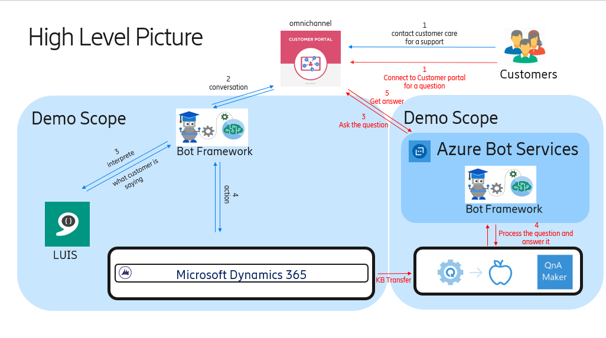

[[summary]]
=== Desired State Summary

The following diagram provides a view of the desired state: 

[#img-arch]
.Desired State Summary
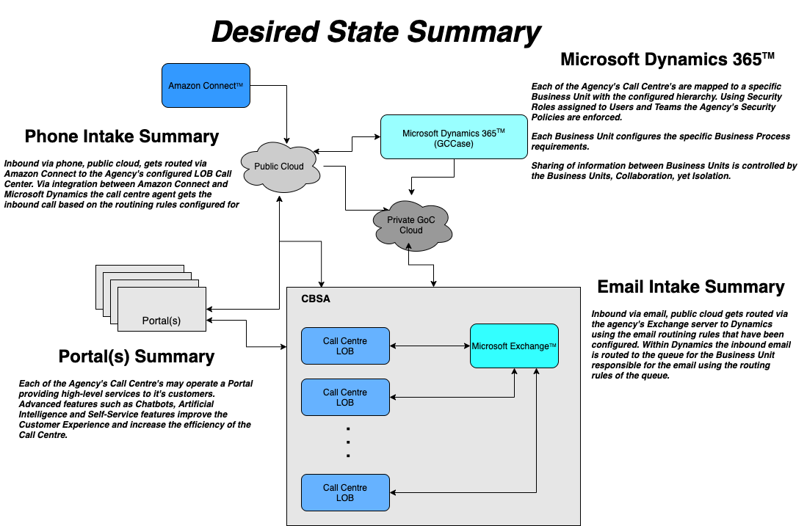

<<<

[[gap]]
=== Gap Analysis

The _gap_ represents the portions of our journey where the _road_ may not be smooth or even exist. There may be other barriers that must be addressed in order to successfully arrive at the destination i.e. the _desired state_.

[#img-gap]
.Gap Analysis
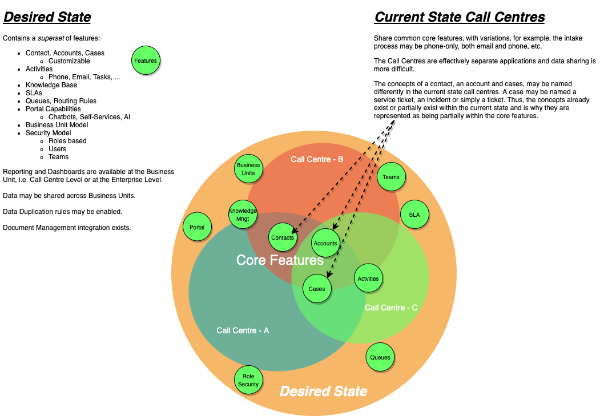

The figure above visually summarizes the gap the Agency's Call Centres face in transitioning form the current state to the desired state. In short, there are no identifiable features or requirements of the individual Call Centres that are not implementable within the desired state's collection of features. This does _not_ mean that we can simple transform the Call Centre's activities without undergoing the work. It simply means that there are no _technological_ barriers, i.e. gaps in the roads, preventing us from the planned efforts.

The features which are the _green circles_, not all shown, of the desired state provide more that what is required today. This should be interpreted to mean that from a gap analysis point of view, there are no identifiable technology requirements preventing the _transformation_. 

<<<

[[items]]
=== Activities

Having completed the <<gap>>, the next stage involves listing, in no particular order, the activities required for the transformation. The following is a list of activities, as determined via an analysis of the current state. These activities may be associated to _multiple_ requirements during the transformation phase.

[IMPORTANT]
====
Not all *LOB* Call Centres of the Agency were reviewed in-depth. But, based on general observations, discussions and review of previous analysis work, the activities have been reasonably extracted.
====

.Activities
[cols="25%,75%a"]
|===
|Activity|Description

|Contact
|The _customer_ as described in <<contacts>>. The contact must allow for customizations that the *LOB* may require. Contact access must be controllable by the *LOB* and data duplication safeguards must be available.

|Account
|The _organizations_ that interact with the Agency's Call Centres as described in <<accounts>>. The account must allow for customizations that the *LOB* may require. Account access must be controllable by the *LOB* and data duplication safeguards must be available. Multiple contacts may be associated with an account and access controls must still remain in effect, i.e. contacts from different *LOB* may be associated with the same account but are not _necessarily_ visible to each *LOB*.

|Case
|The service ticket as described in <<cases>>. The case must allow for customizations that the *LOB* may require. Case access must be controllable by the *LOB*. 

|Data Duplication Configuration
|
Configuration of the data duplication rules.

|Activities
|
Configuration of the customer activity types. This includes: 

* Phone Calls
* Email
* Tasks

Each *LOB* may choose to configure the supported activity types differently.

|Business Units
|The various *LOB*, i.e. Agency's Call Centres, must be organized by Business Units. An appropriate hierarchy must be determined in order to efficiently report and summarize aspects of each *LOB* and the Agency's operations as a whole. See <<bu>>

|Teams
|The various *LOB*, i.e. Agency's Call Centres, require a proper team structure to control access to the *LOB*. The security model for each *LOB* may have different requirements and users may be members of multiple teams. <<teams>>

|Security Roles
|Teams and users that are members of the *LOB* may be assigned security roles. The security roles provide the access controls at the entity level. <<sr>>

|Service Level Agreements, *SLA*
|The various *LOB*, i.e. Agency's Call Centres, may require *SLA* and each *SLA* may be configured differently. See <<sla>>

|Queues
|Configuration of the *LOB* intake queues and routing rules. Each *LOB* may have different requirements of the intake process and the routing requirements. See <<queues>>

|Document Management
|Each *LOB* may have different document management needs. This activity relates to the integration between the Agency's Apollo Document Management facility and the desired state.

|Reporting and Dashboards
|Each *LOB* may have different reporting and dashboard summary requirements. In addition, the hierarchial Business Unit model allows for an Agency-wide view of reports and dashboard summaries.

|Knowledge Management
|Configuration of the resources required by the customer support agents of the *LOB*, such as documents, forms, etc.,  to support customer service requests. Also required, is integration with the Agency's Apollo Document Management facilities.

|Email Integration
|Integration of the desired state with the Agency's Email system.

|Amazon Connect(TM) Integration
|Integration of the desired state with the Amazon Connect(TM).

|Portal
|Private and Public-facing _Portals_ abstract access to the desired state and provide a _higher-level_ abstraction of the available resources. These higher-level features include: 

* Chatbots
* Self-service capabilities
** Access to Knowledge Management resources, etc.
* Artificial Intelligence (AI) resources.

Portal access to the desired state is also licensed differently. Public-facing portals allow access to non-licensed desired state resources.

|Data Migration
|Each *LOB* may choose to migrate existing data, e.g. contacts, accounts, cases, etc., to the desired state. In addition, each *LOB* may have different data retention rules.  

The data migration activity is best orchestrated by a single entity representing all the *LOB* to avoid data duplication. Several approaches to data migration may be undertaken and is a complex activity outside the scope of the roadmap recommendations.

|===

These Activities collectively comprise the tasks necessary to arrive at the desired state. The next stage provides recommendations and prioritizes the activities required for the transformation.

<<<

[[prioritize]]
=== Prioritize Sequence

There is no optimum sequence of activities. The priorities and the order of steps may be different for each organization for a variety of reasons. The following sequence presents a reasonable order of activities based on experience with similar transformations.

[cols="40%a,5%,55%a",frame="none",grid="none"]
|===
|||

|
. Business Units
** Hierarchy
. Teams
. Security Roles
. Users
. Contacts
. Accounts
. Cases
** Business Processes
. Activities
** Email Configuration
. SLA
. Queues
. Document Management
. Reports and Dashboards
. Refine Security Model
. Portal
** Chatbots
** Self-service
** AI
. Data Migration

|
|image::resources/images/sequence.png[Roadmap to the Desired State,380,3800,align='center']

|===

<<<

[[timeline]]
=== Timeline Sequence

In order to get a clearer idea of the approximate Level of Effort (*LOE*), the following diagram provides a visual timeline of these activities. The actual number of LOB that are transitioned to the desired state would alter these approximations. But, nonetheless, it provides a reasonable idea of the effort required. Additional collaboration within the Agency must also be considered. For example, the Agency's Security Group's would be involved for ensuring the Agency's security policies are enforced.

[#img-timeline]
.Timeline
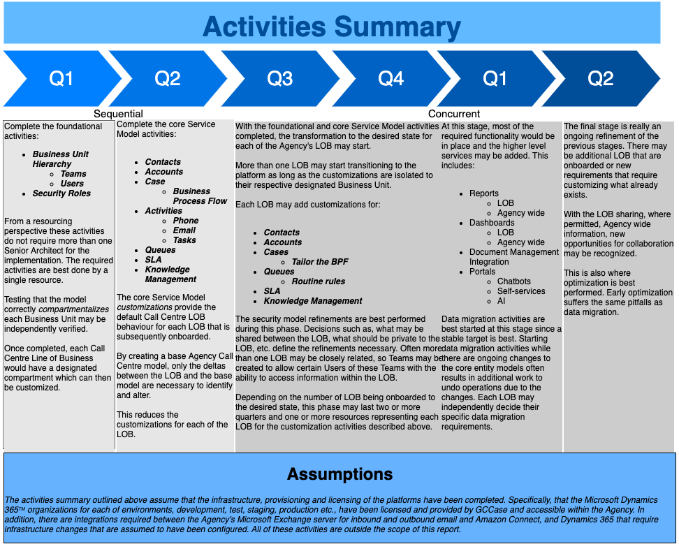

<<<

== Final Recommendations and Strategies

The Agency's prior selections of *Microsoft(R) Dynamics 365*(TM) hosted and managed by *GCCase* and *Amazon Connect*(TM) provide all of the features outlined of the desired state. Thus, the need for a separate _options analysis_ of other technology stacks is unnecessary. Each of the features listed in the <<desired>> are available within these selections. The requirements of the Agency's Call Centres *LOB* are a subset of the set of features as outlined in the <<gap>>. 

The *ESR* provides a view of what is possible along with recommendations for this transformation. The recommendations provide a guideline based on best practices using *Microsoft(R) Dynamics 365*(TM). Each *LOB* may have unique considerations that may require exceptions to the recommendations, which is perfectly acceptable. The roadmap is meant to be fluid and not set in stone. 

The transformation does not require transitioning the *LOB* all at once. In fact, partial transitioning allows for refinements to the plan and subsequent transitions of the remaining *LOB* are more seamless and less disruptive. 

Initially, the first few steps of the transformation requires a Senior Architect to set up the initial organization, the *Microsoft(R) Dynamics 365*(TM) term for the whole application. The creation of the Business Units, initial Security Roles, Teams and Users is a critical foundational part of the plan. Subject Matter Experts (*SME*) from each of the *LOB* are required to create the _Core Service Model_ (*CSM*) referred to in Q2 of the <<timeline>>.  

The *CSM*'s objective is to provide the common ground for the *LOB*. Since each *LOB* may operate differently, both in terms of business process and data collection, the task of customizing each *LOB* becomes that of identifying the structural and behavioural differences between the *CSM* and the *LOB* specific model. The structural differences pertain to the data collection model and data specific reporting requirements. The behavioural differences pertain to the *LOB* operating differences such as, the Business Process Flow, *SLA*, and so forth. 

Once the differences have been identified, onboarding each *LOB* involves application of the customizations to the *LOB*'s Business Unit, referred to in Q3/Q4 of the <<timeline>>. The Q3/Q4 activities can occur concurrently, i.e. onboarding of each *LOB* can occur in parallel.

<<<

Once the foundational pieces are in place work on the key core entities, the problem domain components in Dynamics, may commence. This includes the _contact_, _account_, _case_ and the activity type entities, such as, phone call, email, task, and so forth. This work may be *LOB*-centric in terms of the customization requirements, for instance: 

* attribute requirements
** e.g. custom fields on the contact, such as an Agency identifier
* business process flow
** stages of a case for a *LOB*
* activity types to support
** e.g. email only or email and phone
* SLA
** each *LOB* may configure their Service Level Agreements as per requirements
* Reporting and Dashboard
** each *LOB* may have different reporting and summary dashboard needs
* Knowledge Management configuration

These customizations may be unique to the *LOB* or there may be situations where they share common requirements. 

The roadmap prioritization sequence allows for a refinement step of the security roles. This is an important part of the process to fine tune the *LOB* security requirements, i.e. what may be shared or not.

<<<

== Abbreviations and Glossary

.Abbreviations and Glossary
[cols="10%,15%,75%a"]
|===

|Term|Explanation|Description

|ATT|Active Team Template|

* An Active Team Template makes it possible to create _ad-hoc_ security teams which can be used to restrict specific records. ATT can be associated with contacts, accounts or cases.

|API|Application Programming Interface|

* A published interface that provides a mechanism for communication between systems. The underlying communications protocol is _not_ specified.

|AI|Artificial Intelligence|

* Computers with Artificial Intelligence software are able to perform tasks that normally require human intelligence, such as visual perception, speech recognition, decision-making and can be used to assist the customer with basic services.

|BPF|Business Process Flows|

* A Business Process Flow is a sequential representation of a process and its components, including operations, timelines, people involved, and resources needed. Business Process Flows are used to simplify a complex operation by breaking it down to a series of stages.

|BU|Business Unit|

* A BU is an organizational structure such as a department or team that manages a product or service. 

|Chatbot||

* Whereas a _bot_ is a type of computer program designed to perform basic tasks, a _subtype_ of a bot, the _chatbot_, specializes in interacting via chat or dialog and typically used over the internet. A chatbot is not an abbreviation.

|CSM|Core Service Module|

* The set of features of the CSM, the foundational layer, which each Call Centre *LOB* uses to assess the structural and behavioural differences, in order to determine the customizations required.

|ESR|Enterprise Strategic Roadmap|

* A blueprint outlining a strategy and a process for an Enterprise's digital transformation, for example, _this_ document.

|FAQ|Frequently Asked Questions|

* A document or list of common questions along with their answers that are frequently asked. Rather than having the customer call in or inquire about an issue or service, the FAQ document may provide the information as part of a self-service feature. The FAQ document may be part of the KM repository.

|Term|Explanation|Description

|KM|Knowledge Management|

* In the context of service support, a Knowledge Management facility provides a collection of tools to manage the creation, updating and access to knowledge related materials such as, *FAQ* documents, self-service resources, forms and so forth. 

|KPI|Key Performance Indicators|

* KPI are the metrics associated with how the *LOB* is achieving it's objectives. Metrics associated with a Call Centre may include how many cases were serviced during a specific period, the average response time between when a case was opened and resolved and much more. Key Performance Indicators can also be rolled up and viewed as a whole, such as the Agency's KPI.

|LOB|Lines of Business|

* Line of Business (LOB) is a general term that describes the related product or services a business offers. An organization's desktop support centre, for example, might claim its LOB is desktop support.

|OOB|Out Of the Box|

* A term used to indicate a product feature that is readily available versus having to develop custom code to implement a similar feature. Using an *OOB* capability versus developing a feature is always preferred but sometimes the latter occurs simply because the *OOB* was not known to exist.

|SDK|Software Development Kit|

* A software development kit is a collection of vendor supplied libraries meant for enhancing or customizing a product. *SDK* typically require the services of a developer with experience in the _language_ of the *SDK*, for example, *C#*.

|SLA|Service-Level Agreement|

* A Service-Level Agreement (*SLA*) defines the level of service expected by a customer from organization, with the contract specifying the metrics by which that service is measured.

|SME|Subject Matter Expert|

* A Subject Matter Expert (*SME*) is a person with a deep understanding of a particular area or topic. In the context of the *ESR*, the *SME*  would be the person with a deep understand of the Call Centre *LOB* being on boarded to the desired state.

|===

<<<

== List of References

The following references were used in the preparation of the *ESR*

.References
[cols="30%,70%a"]
|===

|Description|Link

|Agency Call Centre Review|http://apollo.omega.dce-eir.net/livelink/llisapi.dll/Overview/73710115

|Client Onboarding (Wireframe)| http://apollo.omega.dce-eir.net/livelink/llisapi.dll/55960599/TCCU_-_Client_Onboarding.png?func=doc.Fetch&nodeid=55960599

|Contact Centre as a service|TODO

|GCCase Functional Architecture|http://apollo.omega.dce-eir.net/livelink/llisapi.dll?func=ll&objaction=overview&objid=34941358
 
|GCCase Technology Architecture Description (*TAD*)|http://apollo.omega.dce-eir.net/livelink/llisapi.dll?func=ll&objaction=overview&objid=34941357

|Production Support Data Elements|http://apollo.omega.dce-eir.net/livelink/llisapi.dll?func=ll&objaction=overview&objid=56499922

|Production Support Change Requests|http://apollo.omega.dce-eir.net/livelink/llisapi.dll?func=ll&objaction=overview&objid=56562895
 
|Select Client Type (Wireframe)|http://apollo.omega.dce-eir.net/livelink/llisapi.dll/55957304/TCCU_Select_Client_Type.png?func=doc.Fetch&nodeid=55957304
 
|TCCU Application Log - An example of extracting information for basic reporting|http://apollo.omega.dce-eir.net/livelink/llisapi.dll?func=ll&objaction=overview&objid=56249544

|TCCU Testing Status Report|http://apollo.omega.dce-eir.net/livelink/llisapi.dll?func=ll&objaction=overview&objid=56251667
 
|TCCU Prod Support Functionality Requests With Comments|http://apollo.omega.dce-eir.net/livelink/llisapi.dll?func=ll&objaction=overview&objid=56307242

|===
