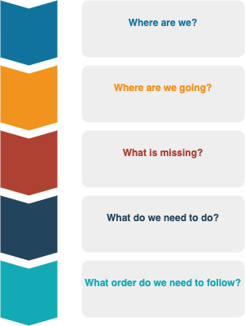

= Enterprise Strategic Roadmap
:revealjs_theme: black
:customcss: resources/css/theme.css
:source-highlighter: highlight.js
:coderay-css: style
:revealjs_width: 1408
:revealjs_height: 792
:revealjs_slideNumber: c/t
:revealjs_showNotes: false
:revealjs_controls: false
:revealjs_controlsLayout: bottom-right
:revealjs_transition: slide
:revealjs_parallaxBackgroundImage: http://localhost:5000/resources/images/bg.png
:Author:    Hany Greiss <Hany.Greiss@cbsa-asfc.gc.ca>
:Email:     Hany.Greiss@cbsa-asfc.gc.ca
:revdate:   11/30/2021
:revnumber: 1.0
:revremark: DRAFT
:revealjsdir: ./reveal.js
:revealjs_plugins: resources/js/plugins.js
:revealjs_plugins_configuration: resources/js/plugins-conf.js
:revealjs_hash: true

_Detailed Overview_

{revdate}

++++

     
     
     
 

 

     CBSA-ASFC
     Enterprise Strategic Roadmap
     
 

 
 <link rel="stylesheet" href="reveal.js/plugin/menu/menu.css" />
 <link rel="stylesheet" href="https://maxcdn.bootstrapcdn.com/font-awesome/4.5.0/css/font-awesome.min.css">
 
 
 
 
 
 

++++

[.columns]
== Agenda

[.column]
[%step]
* Executive Summary
* Purpose
* Roadmap Outline
[%step]
** Current State
** Desired State
** Gap Analysis
** Activities
** Prioritize Sequence

[.column]
[%step]
* Desired State
[%step]
** Business Units
** Contacts, Accounts
** Cases
*** Case Creation
*** Business Process Flows
** Activities

[.column]
[%step]
* Gap Analysis
* Activities
* Prioritize Sequence
* Q & A

[.notes]
--

--

== Executive Summary

The *ESR*, is a strategic blueprint:

* a guide for implementing a _digital transformation_
** improve the *_Customer Experience_*
** align the *LOB*
** enhance reporting
* Agency change management plan;

[.notes]
--

--

[.columns]
== Purpose

[.column]
[%step]
* *ESR* is:  
[%step]
** planning tool
** _visual roadmap_
* Stakeholders Buy-In
[%step]
** _Big Picture_.
** Conveys the transformation
** improves the _Customer Experience_.
** Depicts how productivity will improve.

[.column]
[%step]
* Sharing Details
[%step]
** Multiple views
*** Strategic thinkers.
*** Tactical implementers.
** Timelines of the transformation.
* Prioritize Activities
[%step]
** Planning 

[.notes]
--

--

[.columns]
=== Roadmap Outline

[.column]
[%step]
* Current State
* Desired State
* Gap Analysis
* Analysis
* Prioritize Sequence

[.column]
[%step]

[.notes]
--

--

=== Current State

image::resources/images/silos.png[]

[%step]
* limiting reporting
* prone to duplication across *LOB*
* differing business processes: 
** increases training requirements
** increases the operations performed across *LOB*
* redundant maintenance procedures

=== Current State

[%step]
* Knowledge Management
* SLA
* Portals
** Chatbots, Self-service, AI

[.columns]
=== Desired State

[.column]
[%step]
* Business Units
* Security Model
** Teams
** Users
** Role based

[.column]
[%step]
* Contacts
* Accounts
* Cases
** Business Process Flows
** Automated case creation
* Actvities
** Emails, Phone calls, Tasks

[.column]
[%step]
* Portals
* Queues, automated routing
* SLA
* Entitlements
* Knowledge Management

=== Gap Analysis

=== Activities

=== Prioritize Sequence

